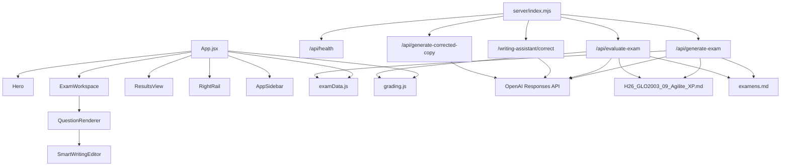

# Cartographie des modules

## Vue modules

## Lecture rapide

- `App.jsx` orchestre l'etat global du cycle d'examen.
- `ExamWorkspace` porte l'experience de passage de l'examen.
- `QuestionRenderer` adapte l'UI au type de question.
- `SmartWritingEditor` encapsule la logique de correction linguistique en cours d'ecriture.
- `ResultsView` centralise la restitution de la correction.
- `server/index.mjs` concentre actuellement la quasi-totalite du backend.

## Points de couplage a surveiller

- `App.jsx` porte beaucoup d'etat et de transitions d'ecran.
- `server/index.mjs` cumule routing, prompts, schemas, sanitation et fallbacks.
- les contrats JSON entre frontend et backend sont implicites dans certains flux.

