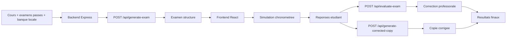

# Flux examen

## Intentions du flux

- garder un examen generable meme sans IA;
- distinguer clairement la correction professorale et la copie corrigee linguistique;
- conserver une structure stable entre generation, passation et restitution.

