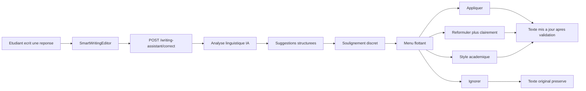

# Flux assistant linguistique

## Intentions du flux

- ne jamais modifier automatiquement le texte;
- garder le sens original;
- separer strictement langue et contenu;
- rendre l'aide discrete pour ne pas perturber l'examen.

